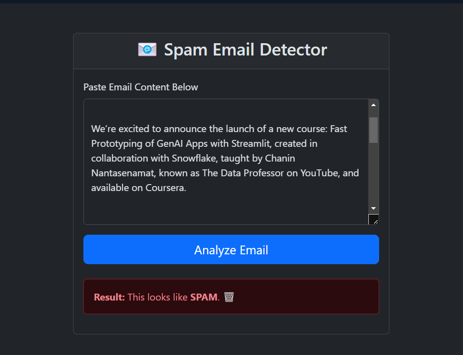

# AI-Powered Spam Detection Service

An end-to-end, full-stack web application that leverages a custom-trained DistilBERT model to classify email content with high accuracy. This project demonstrates a complete MLOps workflow, from data preparation and model fine-tuning to containerized deployment and automated testing.

**[➡️ View the Live Demo Here](https://huggingface.co/spaces/RajHarshrr/Harsh-spam-detector)**

---

<p align="center">
  
</p>

## 📄 Project Overview & Vision

The initial goal was to build a simple spam detector. However, the project evolved into a comprehensive demonstration of professional software engineering and machine learning practices. The application is architected to be robust, scalable, and maintainable, featuring a decoupled frontend and backend, a containerized environment with Docker, and a custom AI model trained to overcome the limitations of pre-existing, general-purpose models.

This project is not just a proof-of-concept; it is a showcase of the iterative process of building and refining an intelligent system, including analyzing its failures and systematically improving its performance.

## ✨ Key Features & Technical Highlights

* **Custom Fine-Tuned Model:** Fine-tuned a **DistilBERT** model on the **Enron Email Dataset** using a **GPU on Google Colab**, achieving high accuracy on real-world email patterns.
* **Scalable Backend Architecture:** Engineered with **Flask** using a modular structure (**Blueprints**) to separate concerns. It exposes a clean **REST API** for predictions, making the backend independent of the frontend.
* **Modern, Asynchronous Frontend:** A responsive and user-friendly interface built with **Bootstrap** and vanilla **JavaScript**. It uses the `fetch` API to communicate with the backend without page reloads, ensuring a smooth user experience.
* **Containerized for Production:** The entire application is containerized with **Docker**, guaranteeing a consistent and reproducible environment for both development and deployment.
* **Automated Testing:** Includes a suite of **unit tests** for the API endpoint, written with **pytest**, to ensure code quality and reliability.
* **Professional MLOps Workflow:** The project demonstrates a complete end-to-end workflow:
    1.  **Problem Identification:** Realized a baseline sentiment model was insufficient.
    2.  **Data Sourcing & Cleaning:** Processed the complex Enron dataset.
    3.  **GPU-Powered Training:** Leveraged Google Colab for efficient model fine-tuning.
    4.  **Deployment:** Deployed the containerized application and model to Hugging Face Spaces.
    5.  **Iteration:** Analyzed the model's "false positives" and identified the next steps for improvement (augmenting the dataset).

## 🛠️ Tech Stack

| Category             | Technologies                                                                   |
| -------------------- | ------------------------------------------------------------------------------ |
| **Backend** | Python, Flask, Gunicorn                                                        |
| **Machine Learning** | PyTorch, Transformers (DistilBERT), Hugging Face, Scikit-learn, Pandas, Datasets |
| **Frontend** | HTML, CSS, Bootstrap, JavaScript                                               |
| **Testing** | pytest, pytest-flask                                                           |
| **Deployment & DevOps** | Docker, Git, Git LFS, Hugging Face Spaces, Google Colab                        |

## 🚀 How to Run Locally

To get a local copy up and running, follow these simple steps.

### Prerequisites

* Python 3.9+
* Git and Git LFS installed (`git lfs install`)

### Installation & Setup

1.  **Clone the repository:**
    ```bash
    git clone [https://github.com/harsh24mi/spam-email_det-app.git](https://github.com/harsh24mi/spam-email_det-app.git)
    cd spam-email_det-app
    ```

2.  **Create and activate a virtual environment:**
    ```bash
    python -m venv venv
    # On Windows
    .\venv\Scripts\Activate
    # On macOS/Linux
    source venv/bin/activate
    ```

3.  **Install dependencies:**
    ```bash
    pip install -r requirements.txt
    ```

4.  **Run the application:**
    ```bash
    flask run
    ```
    The application will be available at `http://127.0.0.1:5000`.

## 🧪 Running Tests

This project includes a suite of automated tests for the API to ensure its reliability. To run the tests:
```bash
pytest
```

---

## 👤 Author

* **Harsh Raj** - [harsh24mi](https://github.com/harsh24mi)

## 📄 License

This project is licensed under the MIT License - see the [LICENSE](LICENSE) file for details.
